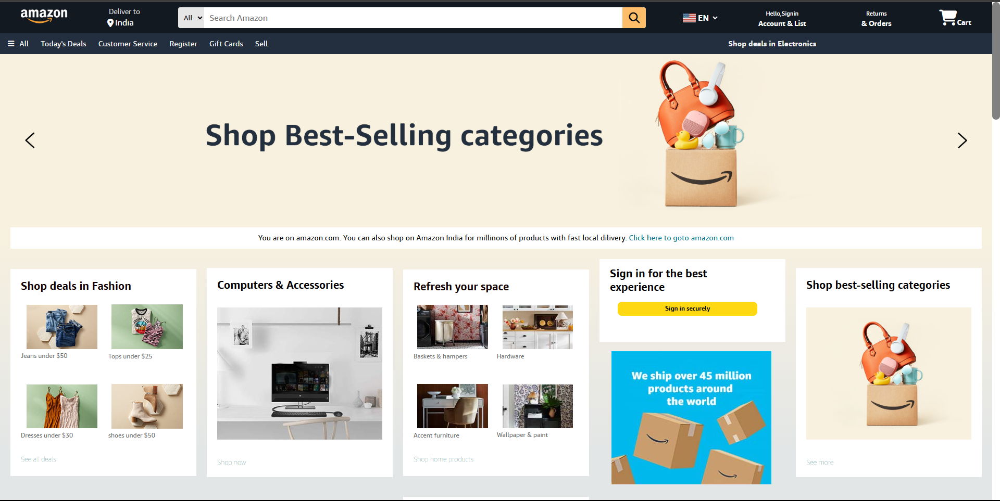

# Amazon Homepage Clone  

A simple static clone of the Amazon homepage built with **HTML** and **CSS**.  
This project was created to practice front-end layout design and showcase CSS styling skills.  

---

## 📸 Screenshot  


---
## 🌐 Live  
Check it out here 👉 [Amazon Clone Live](https://pragya-12112001.github.io/amazon-clone/) 

---

## 🚀 Features  
- Replicated Amazon’s homepage structure and layout  
- Navigation bar with search section and links  
- Product grid layout  
- Footer with multiple columns  
- Purely front-end (no functionality like login, cart, or backend)  

---

## 🛠 Tech Stack  
- **HTML5**  
- **CSS3**  

---

## 📂 Getting Started  

1. Clone the repository:  
   ```bash
   git clone https://github.com/Pragya-12112001/amazon-clone.git
   
2. Open the project folder:  
   ```bash
   cd amazon-clone
   
3. Open **index.html** in your browser
